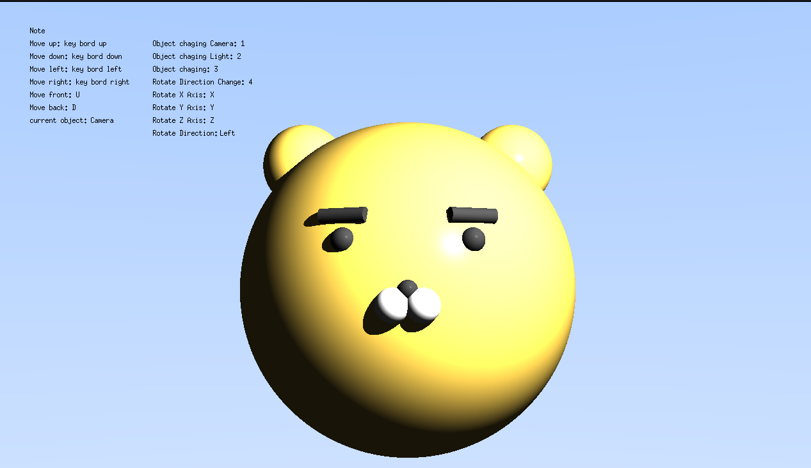

# miniRT

42 커먼코어 과제로, C언어로 구현한 레이트레이싱(Ray Tracing) 3D 렌더링 엔진입니다.

## 프로젝트 개요

- **기간:** 2025.05.24 ~ 2025.06.19
- **인원:** 2인 팀 프로젝트
- **담당 파트:** 도형(구·평면·실린더 등) 파싱, 카메라 및 조명 구현, 물체 회전 애니메이션 구현

miniRT는 카메라, 조명, 다양한 3D 도형(구, 평면, 실린더 등)으로 구성된 장면(scene)을 파일로 입력받아, 광선-객체 교차 연산을 통해 3D 장면을 2D 화면에 렌더링하는 프로젝트입니다.

## 렌더링 결과




## 주요 구현 내용

### 조명(Lighting) 처리
- Phong 조명 모델을 기반으로 ambient(주변광) / diffuse(난반사) 요소를 계산해 물체 표면의 밝기를 구현
- 광원의 위치, 색상, 밝기 비율(bright_ratio)을 별도 구조체로 관리해 씬(scene)마다 다른 조명 조건을 설정할 수 있도록 처리

### 도형 파싱 및 렌더링
- .rt 확장자의 씬 파일을 파싱해 카메라, 광원, 도형(구·평면·실린더) 정보를 구조체 형태로 저장
- 각 도형별로 광선과의 교차 여부 및 교차 지점을 계산하는 hit 판정 로직을 구현 (예: 구는 이차방정식의 판별식으로 교차 여부 판단)
- 교차 지점의 법선 벡터, 반사율(albedo) 등을 hit_record 구조체에 기록해 조명 계산에 활용

## 기술 스택

- 언어: C
- 그래픽스 라이브러리: [MiniLibX 등 실제 사용한 라이브러리]
- 수학: 벡터 연산(내적, 외적, 정규화), 광선-객체 교차 판정

## 빌드 및 실행 방법

```bash
make
./miniRT [파일 경로].rt
```


